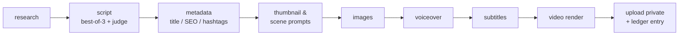
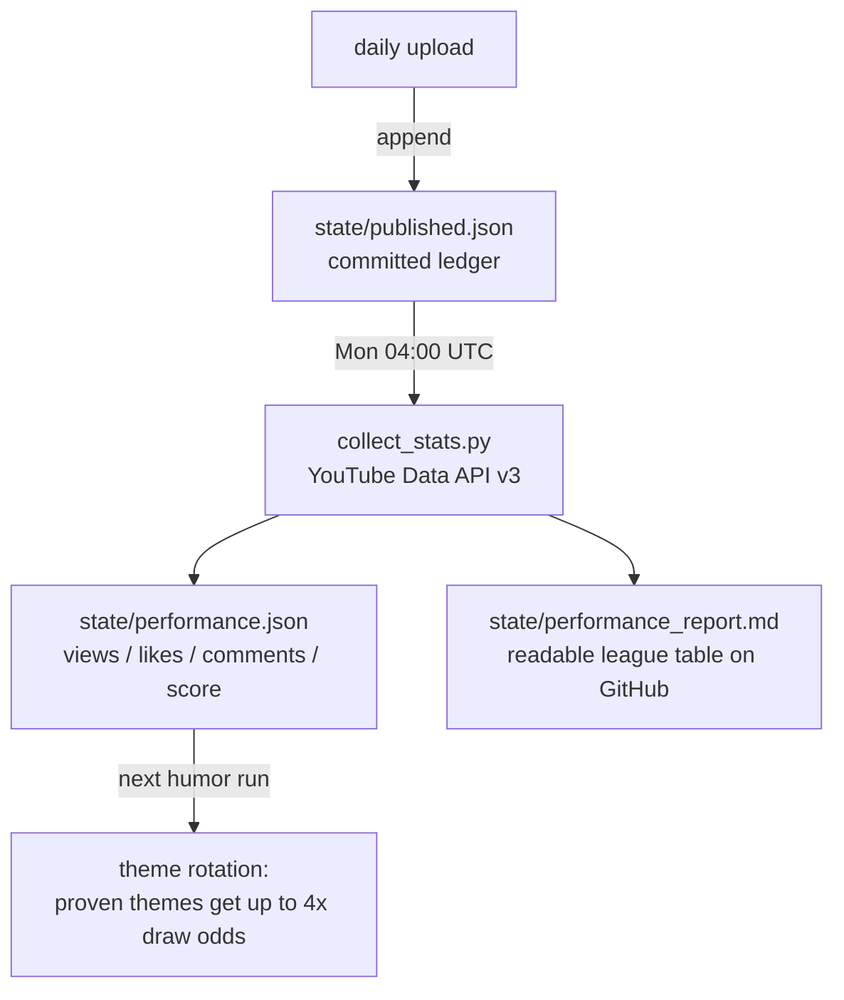

# AI YouTube Automation System

A production-ready, **fully-free-capable** system that runs a YouTube Shorts channel end to end:
it discovers topics, writes and quality-gates scripts, generates images, voiceover, subtitles and
a finished video, uploads it — then **learns from real view/like/comment data** to make the next
video better.

> Human-in-the-loop by design: uploads default to **private** and nothing becomes visible
> without a human flipping it to Public in YouTube Studio.

---

## Content streams

| Stream | What it makes | Source of topics |
|--------|---------------|------------------|
| **AI News** (`news`) | Daily developer-focused AI news Shorts — new models, releases, what actually ships | RSS / trend feeds (Reddit TIL, Google Trends, YouTube RSS), deduped against history |
| **Dev Humor** (`dev_humor`) | Bittersweet developer comedy — programming concepts as heartbreak metaphors (*"She was my primary key, but in her query she never called me."*) | 25 curated themes (SQL, git, async, regex, HTTP codes, broken quotes…), rotation weighted by measured engagement |

---

## Long-form narration (human-voiced)

The automated pipeline above makes Shorts. The **case-study explainer** — 8-14 minutes,
narrated by a human, no b-roll — is a different craft, and it lives in
[`docs/NARRATION_PLAYBOOK.md`](docs/NARRATION_PLAYBOOK.md): an 11-beat structure with
word budgets, the sentence-level rules that hold attention, and a topic → script
worksheet.

```bash
python scripts/write_script.py --worksheet --minutes 12          # blank beat sheet, no LLM
python scripts/write_script.py --topic "Why enterprise AI agents fail"
python scripts/write_script.py --topic "..." --stop-after outline   # edit the story first
python scripts/write_script.py --check my_script.txt --minutes 12   # QA your own writing
```

Generation is three passes — research (every number tagged CONFIRMED/UNVERIFIED) →
beat sheet → narration — because one-shot "write a 10-minute script" calls produce
shapeless summary. `backend/app/pipeline/narrative.py` then measures the finished words:
opener strength, number density, sentence length, direct address, pattern interrupts,
unglossed jargon, and whether the close calls back to the open.

Worked example, beat sheet and fact ledger:
[`docs/examples/agentic_ai_case_study_script.md`](docs/examples/agentic_ai_case_study_script.md).

To derive the format from a reference channel instead of assuming it,
`scripts/analyze_channel.py` measures real transcripts — medians for pace, sentence
length and number density, where the first number lands, and where structural breaks
fall as a share of runtime:

```bash
pip install yt-dlp
python scripts/analyze_channel.py --channel https://www.youtube.com/@SomeChannel --top 10
python scripts/analyze_channel.py --transcripts ./transcripts    # files you already have
```

---

## The generation pipeline

Every video runs through a **LangGraph** state machine. Each stage persists its output to the
database, so the dashboard shows live progress and failed runs are inspectable.



### Script quality gate (best-of-N + LLM judge)

The script decides retention, likes and shares more than anything downstream — and single-shot
free models produce very uneven drafts. So the script stage:

1. Generates **3 candidate drafts** at varied temperatures (comedy runs hotter than news, so drafts genuinely differ)
2. An **LLM judge ranks them** against an engagement rubric — hook-in-2-seconds, concrete specifics, payoff, quotable last line — and only the winner gets rendered
3. The gate never sinks a run: judge failures fall back to the first draft, individual draft failures are tolerated

Set `SCRIPT_CANDIDATES=1` to disable (single-shot, cheapest). Cost of the gate is ~4 LLM calls
per video instead of 1 — free on OpenRouter's free tier.

### Performance feedback loop

The pipeline doesn't just publish — it measures what worked and steers itself:



- **Score** = likes + 2 × comments + views/100 — likes/comments dominate on purpose: for Shorts,
  raw views mostly measure the feed algorithm, while reactions measure the content.
- Untested themes always keep base exploration weight, so rotation never tunnel-visions.
- All cross-run state is **committed JSON in `state/`** (not the DB) because CI runners are
  ephemeral — the repo itself is the channel's memory.

---

## Design philosophy: a workflow, not an agent

This project uses **LangGraph** (an agent framework) — but deliberately as a **fixed workflow**,
not an autonomous agent. Every run takes the same path; no LLM ever decides *what to do next*.

| | This project (workflow) | An agent |
|---|---|---|
| Control flow | Fixed by code (`research → script → … → video`) | Chosen by the LLM at runtime |
| Tool use | Called at predetermined steps | Picked dynamically from a toolbox |
| Failure mode | Predictable, resumable, inspectable | Can wander, loop, burn tokens |
| Cost per run | Known upper bound | Open-ended |

**Why:** this pipeline runs unattended on a schedule and publishes to a real channel. A 06:00 UTC
run should be boringly predictable — deterministic flow means a failed run points at exactly one
stage, and a passing run costs exactly the same as yesterday's.

It still borrows the *useful* parts of agentic design, without giving up control:

- **LLM-as-judge** — one model evaluates another's drafts and picks the winner (evaluator
  pattern), but its verdict selects content, never changes the graph's path.
- **Environmental feedback** — real engagement data reweights future theme selection, but by
  arithmetic, not by an LLM reasoning about it.
- **Model fallback chains + retries** — resilience at every LLM call, with bounded attempts.

The natural place to add true agency later: a bounded self-correction loop at the script stage
(judge scores all drafts low → regenerate with the critique injected → re-judge, capped at 1–2
iterations). LangGraph's conditional edges support this directly.

---

## Architecture

Two ways to run the same pipeline:

### 1. CI mode (zero infrastructure — how the channel actually runs)

GitHub Actions runs everything on a schedule. No server, no database to host, no cost.

| Workflow | Schedule | What it does |
|----------|----------|--------------|
| `daily-video.yml` | 06:00 UTC daily | Discover AI news → generate → upload private → record ledger |
| `daily-humor.yml` | 15:00 UTC daily | Pick humor theme (engagement-weighted) → generate → upload private → record ledger |
| `weekly-stats.yml` | Mondays 04:00 UTC | Fetch public stats for every ledger video → commit `performance.json` + report |

### 2. Server mode (dashboard + API)

```
                         ┌──────────────────────────────────────────────┐
                         │              FastAPI backend (JWT)            │
                         │  /auth /topics /projects /approval /publish   │
                         └───────────────┬──────────────────────────────┘
                                         │
        APScheduler (cron) ──► Celery ──►│──► LangGraph pipeline
        "discover every 6h"    (Redis)   │
                         ┌───────────────▼──────────────┐        ┌──────────────────┐
                         │   PostgreSQL (SQLAlchemy)     │◄──────►│  React dashboard  │
                         │   projects / assets / logs    │        │  (approve/reject) │
                         └───────────────────────────────┘        └──────────────────┘
```

Each media capability (LLM, TTS, images, subtitles, video) is a **pluggable provider** selected
by config, so you can run 100% free/local or swap in paid APIs without touching pipeline code.

---

## Free-first provider matrix

| Capability     | Free default (no key)        | Free/local alternative     | Paid (optional)      |
|----------------|------------------------------|----------------------------|----------------------|
| LLM            | OpenRouter `*:free` models   | Ollama (local)             | any OpenRouter model |
| Trends         | Reddit TIL / Google Trends   | YouTube RSS / search       | —                    |
| Images         | Pollinations.ai (no key)     | Stable Diffusion / FLUX    | OpenAI Images        |
| Voiceover      | Edge TTS (keyless)           | Piper / Kokoro (local)     | ElevenLabs           |
| Subtitles      | Edge TTS word timings        | faster-whisper (local)     | —                    |
| Video          | MoviePy + FFmpeg (local)     | —                          | —                    |
| Stats          | YouTube Data API v3 (free API key) | —                    | —                    |
| DB / Queue     | SQLite (CI) / PostgreSQL + Redis (server) | —             | —                    |

Everything in the "Free default" column runs **without paying anyone**. You only need a free
[OpenRouter](https://openrouter.ai) API key for the LLM.

---

## Setup

> 📖 **New here? Follow the [Complete Setup Guide](docs/SETUP.md)** — a step-by-step
> walkthrough from zero to a self-running channel (~30 min, $0), with a verification
> check after every part and a troubleshooting table.

The short version:

### CI mode (recommended)

Fork/clone, then add these **GitHub Actions secrets** (repo → Settings → Secrets and variables → Actions):

| Secret | What it is |
|--------|------------|
| `OPENROUTER_API_KEY` | Free key from [openrouter.ai](https://openrouter.ai) — powers all LLM stages |
| `YOUTUBE_CLIENT_SECRET_JSON` | Contents of the OAuth Desktop client JSON (Google Cloud, YouTube Data API v3 enabled) |
| `YOUTUBE_TOKEN_JSON` | Contents of the minted OAuth token (run the OAuth flow once locally via `/publish/authorize`) |
| `YOUTUBE_API_KEY` | Plain API key restricted to YouTube Data API v3 — **read-only public stats** for the feedback loop. Needed because the upload token deliberately carries only the `youtube.upload` scope, which cannot read statistics |

That's it — the three workflows take over. Trigger any of them manually from the Actions tab to test.

### Docker (server mode)

```bash
cp .env.example .env          # then edit: set OPENROUTER_API_KEY and JWT_SECRET_KEY
docker compose up --build
```

- API + Swagger docs: http://localhost:8000/docs
- Dashboard: http://localhost:5173
- Default admin is bootstrapped from `FIRST_ADMIN_EMAIL` / `FIRST_ADMIN_PASSWORD` in `.env`.

### Local dev (no Docker)

Prereqs: **Python 3.12** (some ML wheels lag on 3.13/3.14), Node 20+, FFmpeg on PATH.
PostgreSQL + Redis only needed for server mode; the scripts run on SQLite.

```bash
# backend
python -m venv .venv && . .venv/Scripts/activate      # Windows: .venv\Scripts\activate
pip install -e ".[dev]"
alembic upgrade head
uvicorn app.main:app --reload --app-dir backend       # API
celery -A app.core.celery_app.celery worker -l info   # worker  (separate shell)
celery -A app.core.celery_app.celery beat  -l info    # scheduler (separate shell)

# frontend
cd frontend && npm install && npm run dev

# or skip the server entirely — one-shot runs:
python scripts/run_daily.py --content-type news --dry-run
python scripts/run_daily.py --content-type dev_humor --count 1
python scripts/collect_stats.py
```

---

## Project layout

```
backend/app/
  core/        config, logging, security (JWT), celery
  db/          SQLAlchemy models + session
  schemas/     Pydantic request/response models
  api/routes/  auth, topics, projects, approval, publish
  pipeline/    LangGraph graph + nodes + prompts + judge + OpenRouter client
               narrative.py = long-form beat sheet + script validator
  media/       tts/ images/ subtitles/ video/  (pluggable providers)
  services/    trend discovery, YouTube upload, performance feedback loop
  tasks/       Celery tasks
  scheduler/   APScheduler cron jobs
frontend/      React + TypeScript + Tailwind dashboard
scripts/
  run_daily.py       one-shot CI run: discover → generate → upload → ledger
  write_script.py    long-form narration: research → beat sheet → script → QA
  analyze_channel.py measure a reference channel's transcripts against those rules
  collect_stats.py   weekly stats collection + markdown report
state/                     the channel's committed memory (survives ephemeral CI)
  seen.json                news stories already covered
  seen_dev_humor.json      humor themes used recently (rotation)
  published.json           ledger of every upload (feeds stats collection)
  performance.json         measured stats per video (drives theme weighting)
  performance_report.md    human-readable league table — check it on Mondays
.github/workflows/         daily-video, daily-humor, weekly-stats
alembic/                   migrations
tests/                     pytest (19 tests, incl. quality gate + feedback loop)
```

---

## Key configuration

All via environment variables / `.env` (see `backend/app/core/config.py` for the full list):

| Variable | Default | Purpose |
|----------|---------|---------|
| `LLM_MODELS` | free Gemma chain | Comma-separated OpenRouter fallback chain |
| `SCRIPT_CANDIDATES` | `3` | Drafts per video for the quality gate; `1` = single-shot |
| `MAX_TOPICS_PER_RUN` | `3` | Videos per discovery run |
| `YOUTUBE_UPLOAD_PRIVACY` | `private` | Keep `private` — it *is* the approval gate in CI mode |
| `EDGE_TTS_VOICE` | `en-US-AriaNeural` | News voice (humor workflow overrides to a warmer, slower voice) |
| `TREND_PROVIDER` | `reddit_til` | `reddit_til` \| `google_trends` \| `youtube_rss` \| `wikipedia` |
| `STATE_DIR` | `./state` | Where the committed feedback-loop JSON lives |

---

## Human approval flow

- **Server mode:** `discover → generate → PENDING_APPROVAL`. Review script/images/audio/video in
  the dashboard, then **Approve** (queued for upload) or **Reject**. Only `APPROVED` projects reach YouTube.
- **CI mode:** every upload lands **private**. You review in YouTube Studio and flip the good ones
  to Public. Only public videos accumulate stats, so unreviewed content never influences the feedback loop.

Every generated description discloses that narration and visuals are AI-generated.

---

## Legal / ToS note

You are responsible for complying with the YouTube Terms of Service, content policies, and the
terms of every model/API you enable. Keep the human approval step on. See `docs/DEPLOYMENT.md`.

## License

Copyright (c) 2026 Nagesh. Released under the **MIT License** — see [LICENSE](LICENSE).

Note: the default TTS provider `edge-tts` is a GPL-3.0 dependency that users install
separately via pip; it is not bundled in this repository.
